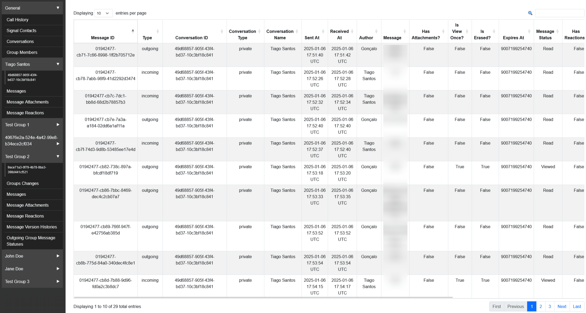

# SignalForensics

SignalForensics is a Python-based forensic tool that automates the decryption and extraction of data from **Signal Desktop**'s local files. It also produces structured CSV and HTML reports for easy analysis or integration with other tools.

SignalForensics is fully automated when run in the same Windows environment as Signal Desktop, but also includes flexible execution modes that adapt to different scenarios and operating systems with varying levels of user input.

This project is based on the work done in the article titled "Decrypting Messages: Extracting Digital Evidence from Signal Desktop for Windows" (dated _TBD_). For a deeper understanding of Signal's data structures and artifacts, as well as the decryption process, we highly recommend checking it out. It provides valuable context and detailed explanations that complement the functionality of this script.

---

## 🚀 Features

- Automated decryption of Signal Desktop artifacts
- Multiple execution modes:
  - **Automatic**: Fully automatic. Must be run on the same environment as Signal Desktop. Windows only.
  - **Auxiliary Key Provided**: Requires the path to the data directory and the decrypted auxiliary key. Can be run on any environment.
  - **Decryption Key Provided**: Requires the path to the data directory and the decrypted SQLCipher key. Can be run on any environment.
- CSV and HTML report generation
- Quiet mode and customizable verbosity
- Optional skipping of decryption/report steps

---

## 📦 Installation

SignalForensics uses [Poetry](https://python-poetry.org/) for dependency management.

1. Clone the repository:
   ```bash
   git clone https://github.com/labcif/SignalForensics
   cd SignalForensics
   ```
2. Install dependencies:
   ```bash
   poetry install
   ```

---

## 🛠️ Pre-built Version

In the [Releases](https://github.com/labcif/SignalForensics/releases), you'll find a `.pyz` version of the script. This self-contained archive is built using the `build.bat` script and bundles all the modules into a single file.

To run the `.pyz` version:

```bash
python SignalForensics.pyz -h
```

---

## 🧑‍💻 Usage

**Basic syntax:**

```bash
SignalForensics [-m auto] -d <signal_dir> [-o <output_dir>] [OPTIONS]
SignalForensics -m aux -d <signal_dir> [-o <output_dir>] [-kf <file> | -k <HEX>] [OPTIONS]
SignalForensics -m key -d <signal_dir> -o <output_dir> [-kf <file> | -k <HEX>] [OPTIONS]
```

**Examples:**

- Auto mode (Windows only):
  ```bash
  SignalForensics -m auto -d "C:\Users\TheUser\AppData\Roaming\Signal" -o output_folder
  ```
- Auxiliary Key Provided:
  ```bash
  SignalForensics -m aux -d signal_data/ -kf aux_key.txt -o output_folder
  ```
- Decryption Key Provided:
  ```bash
  SignalForensics -m key -d signal_data/ -k 9a325c73... -o output_folder
  ```

### ⚙️ Options

| Option                         | Description                                                                              |
| ------------------------------ | ---------------------------------------------------------------------------------------- |
| `-nd`, `--no-decryption`       | Skip decryption and report generation (incompatible with `-m key`)                       |
| `-sD`, `--skip-database`       | Do not export the unencrypted database                                                   |
| `-sA`, `--skip-attachments`    | Skip decryption of attachments and avatars                                               |
| `-sR`, `--skip-reports`        | Skip CSV and HTML report generation                                                      |
| `-mc`, `--merge-conversations` | Merge message-related reports into single CSV files                                      |
| `-t`, `--convert-timestamps`   | Convert timestamps to human-readable format (defaults to UTC if no timezone is provided) |
| `-q`, `--quiet`                | Suppress log output                                                                      |
| `-v`, `-vv`, `-vvv`            | Set verbosity level                                                                      |

### 📂 Input/Output

- `-d`, `--dir`: Path to Signal's data directory
- `-o`, `--output`: Output directory (optional; disables decryption if not provided)
- `-kf`, `--key-file`: Path to file containing key as a hex string
- `-k`, `--key`: Provide key directly as a hex string

---

## 📄 Reports

SignalForensics generates:

- CSV reports for extracted messages, calls, and attachments
- HTML report providing an interactive interface for analysis

Example report:


---

## 📜 License

This project is open-source and licensed under the MIT License. See the [LICENSE](LICENSE) file for details.
